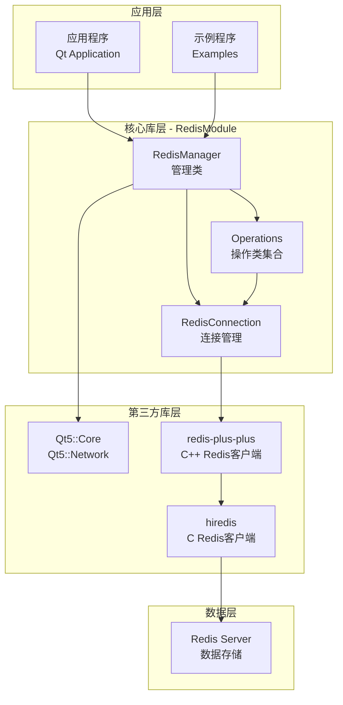
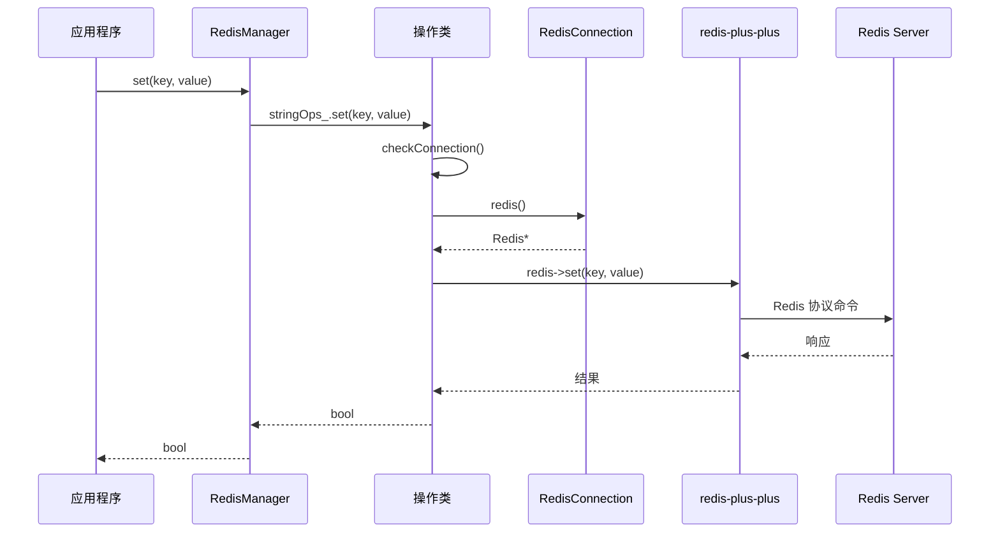
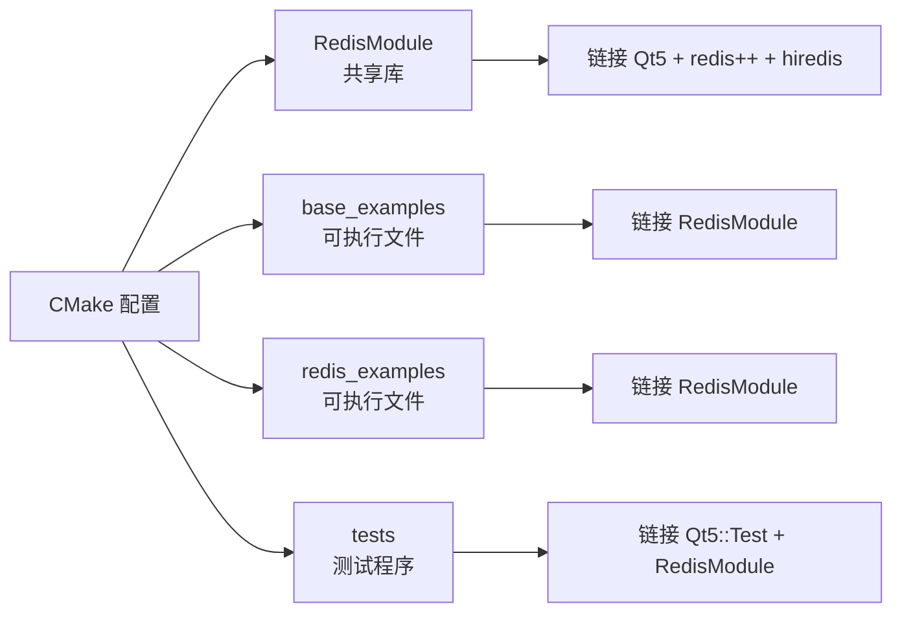

# Qt Redis Plus Plus 项目架构文档

## 项目概述

**项目名称**: Qt Redis Plus Plus  
**技术栈**: Qt 5.12.12 + C++17 + redis-plus-plus + hiredis  
**项目类型**: Redis 客户端库（共享库）+ 示例应用  
**目标**: 为 Qt 应用程序提供便捷的 Redis 操作接口

---

## 整体架构



---

## 模块详细说明

### 1. RedisModule（核心共享库）

**位置**: `/workspace/RedisModule/`  
**输出**: `libRedisModule.so`（共享库）

#### 1.1 类层次结构

```mermaid
classDiagram
    class RedisManager {
        +connectToServer(host, port)
        +disconnect()
        +isConnected()
        +set(key, value)
        +get(key)
        +bytesSet(key, value)
        +bytesGet(key)
        +hSet(key, field, value)
        +hGet(key, field)
        +lPush(key, value)
        +lPop(key)
        +sAdd(key, value)
        +sIsMember(key, value)
        +expire(key, seconds)
        +ttl(key)
        +multi()
        +exec()
        -RedisConnection connection_
        -RedisStringOperations stringOps_
        -RedisBytesOperations bytesOps_
        -RedisHashOperations hashOps_
        -RedisListOperations listOps_
        -RedisSetOperations setOps_
        -RedisSortedSetOperations sortedSetOps_
        -RedisExpirationOperations expirationOps_
        -RedisTransactionOperations transactionOps_
        -RedisGenericOperations genericOps_
    }
    
    class RedisConnection {
        +connectToServer(host, port)
        +disconnect()
        +isConnected()
        +redis()
        -unique_ptr~Redis~ redis_
        -bool connected_
    }
    
    class RedisOperationsBase {
        +checkConnection()
        +execute(func, operation, defaultValue)
        +executeVoid(func, operation)
        #RedisConnection* connection_
    }
    
    class RedisStringOperations {
        +set(key, value)
        +get(key)
    }
    
    class RedisBytesOperations {
        +set(key, value)
        +get(key)
        +del(key)
        +exists(key)
        +append(key, value)
        +size(key)
    }
    
    class RedisHashOperations {
        +hSet(key, field, value)
        +hGet(key, field)
        +hGetAll(key)
        +hDel(key, field)
        +hExists(key, field)
        +hKeys(key)
        +hLen(key)
    }
    
    class RedisListOperations {
        +lPush(key, value)
        +lPop(key)
        +rPush(key, value)
        +rPop(key)
        +lRange(key, start, stop)
        +lLen(key)
        +lIndex(key, index)
    }
    
    class RedisSetOperations {
        +sAdd(key, value)
        +sIsMember(key, value)
        +sRem(key, value)
        +sMembers(key)
        +sCard(key)
        +sUnion(keys)
        +sInter(keys)
        +sDiff(keys)
    }
    
    class RedisSortedSetOperations {
        +zAdd(key, score, member)
        +zRange(key, start, stop)
        +zScore(key, member)
        +zRank(key, member)
        +zRevRank(key, member)
    }
    
    class RedisExpirationOperations {
        +expire(key, seconds)
        +expireAt(key, timestamp)
        +ttl(key)
        +persist(key)
    }
    
    class RedisTransactionOperations {
        +multi()
        +exec()
        +discard()
        +watch(key)
    }
    
    class RedisGenericOperations {
        +del(key)
        +exists(key)
        +keys(pattern)
    }
    
    RedisManager --> RedisConnection
    RedisManager --> RedisStringOperations
    RedisManager --> RedisBytesOperations
    RedisManager --> RedisHashOperations
    RedisManager --> RedisListOperations
    RedisManager --> RedisSetOperations
    RedisManager --> RedisSortedSetOperations
    RedisManager --> RedisExpirationOperations
    RedisManager --> RedisTransactionOperations
    RedisManager --> RedisGenericOperations
    
    RedisOperationsBase <|-- RedisStringOperations
    RedisOperationsBase <|-- RedisBytesOperations
    RedisOperationsBase <|-- RedisHashOperations
    RedisOperationsBase <|-- RedisListOperations
    RedisOperationsBase <|-- RedisSetOperations
    RedisOperationsBase <|-- RedisSortedSetOperations
    RedisOperationsBase <|-- RedisExpirationOperations
    RedisOperationsBase <|-- RedisTransactionOperations
    RedisOperationsBase <|-- RedisGenericOperations
    
    RedisOperationsBase --> RedisConnection
```



#### 1.2 操作类型分类

| 操作类 | 功能描述 | 对应 Redis 数据类型 |
|--------|----------|---------------------|
| `RedisStringOperations` | 字符串操作 | String |
| `RedisBytesOperations` | 字节流操作（二进制数据）| String（二进制安全）|
| `RedisHashOperations` | 哈希表操作 | Hash |
| `RedisListOperations` | 列表操作 | List |
| `RedisSetOperations` | 集合操作 | Set |
| `RedisSortedSetOperations` | 有序集合操作 | Sorted Set |
| `RedisExpirationOperations` | 过期时间操作 | 所有类型 |
| `RedisTransactionOperations` | 事务操作 | 事务 |
| `RedisGenericOperations` | 通用键操作 | 所有类型 |

---

## 数据流图

### 典型操作数据流



---

## 项目目录结构

```
/workspace/
├── CMakeLists.txt              # 根 CMake 配置
├── cmake/                      # CMake 模块
│   ├── 3rdparty.cmake         # 第三方库配置
│   └── build_options.cmake    # 编译选项
├── 3rdParty/                   # 第三方库（预编译）
│   ├── hiredis/               # hiredis 库文件
│   └── redis-plus-plus/       # redis-plus-plus 库文件
├── 3rdSourceCode/             # 第三方库源码
├── RedisModule/               # 核心共享库
│   ├── CMakeLists.txt
│   ├── redismanager.h/.cpp    # 管理类
│   ├── tool/                  # 工具类
│   │   ├── redisconnection.h/.cpp
│   │   ├── redisoperationsbase.h/.cpp
│   │   └── redismodule_export.h
│   └── operation/             # 操作类
│       ├── redisstringoperations.h/.cpp
│       ├── redisbytesoperations.h/.cpp
│       ├── redishashoperations.h/.cpp
│       ├── redislistoperations.h/.cpp
│       ├── redissetoperations.h/.cpp
│       ├── redissortedsetoperations.h/.cpp
│       ├── redisexpirationoperations.h/.cpp
│       ├── redistransactionoperations.h/.cpp
│       └── redisgenericoperations.h/.cpp
├── example/                   # 示例程序
│   ├── base_examples/        # 基础示例
│   │   ├── main.cpp
│   │   ├── workflow.h/.cpp
│   │   └── demos/            # 各种演示
│   └── redis_examples/       # Redis 图片库示例
│       ├── main.cpp          # 交互式菜单程序
│       ├── models/           # 数据模型
│       ├── repositories/     # 仓库模式
│       └── scenarios/        # 业务场景
├── tests/                     # 测试模块
│   ├── CMakeLists.txt
│   ├── fixtures/             # 测试夹具
│   └── benchmarks/           # 性能测试
└── doc/                       # 文档
    ├── PROJECT_OVERVIEW.md
    ├── DEPLOYMENT.md
    └── sss.drawio.svg        # 架构图
```

---

## 构建流程



### 依赖关系

| 模块 | 依赖 |
|------|------|
| RedisModule | Qt5::Core, Qt5::Network, redis++, hiredis |
| base_examples | RedisModule |
| redis_examples | RedisModule |
| tests | Qt5::Test, RedisModule |

---

## 使用场景示例

### 场景 1：字符串缓存

```cpp
RedisManager manager;
manager.connectToServer("127.0.0.1", 6379);

// 设置缓存
manager.set("user:1001:name", "张三");

// 读取缓存
QString name = manager.get("user:1001:name");
```

### 场景 2：图片存储（二进制数据）

```cpp
// 读取图片文件
QFile file("image.jpg");
file.open(QIODevice::ReadOnly);
QByteArray imageData = file.readAll();

// 存储到 Redis
manager.bytesSet("image:1001", imageData);

// 读取图片
QByteArray retrieved = manager.bytesGet("image:1001");
```

### 场景 3：任务队列（List）

```cpp
// 生产者：添加任务
manager.lPush("task_queue", "task_001");
manager.lPush("task_queue", "task_002");

// 消费者：获取任务
QString task = manager.rPop("task_queue");
```

### 场景 4：标签系统（Set）

```cpp
// 添加标签
manager.sAdd("image:1001:tags", "风景");
manager.sAdd("image:1001:tags", "山水");

// 检查标签
bool hasTag = manager.sIsMember("image:1001:tags", "风景");

// 获取所有标签
QVector<QString> tags = manager.sMembers("image:1001:tags");
```

---

## 扩展指南

### 添加新的操作类型

1. **创建新的操作类**（参考现有操作类）
   ```cpp
   // operation/redisnewoperations.h
   class RedisNewOperations : public RedisOperationsBase {
   public:
       explicit RedisNewOperations(RedisConnection* connection);
       // 添加新方法
   };
   ```

2. **在 RedisManager 中添加成员**
   ```cpp
   // redismanager.h
   private:
       RedisNewOperations newOps_;
   
   // redismanager.cpp
   RedisManager::RedisManager(QObject* parent)
       : ...
       , newOps_(&connection_)
   {}
   ```

3. **暴露公共接口**
   ```cpp
   // redismanager.h
   public:
       bool newOperation(const QString& key);
   ```

---

## 性能考虑

1. **连接复用**: RedisConnection 维护单一连接，所有操作共享
2. **异常处理**: 所有操作类继承 RedisOperationsBase，统一异常处理
3. **批量操作**: 使用事务（multi/exec）进行批量操作
4. **二进制数据**: bytes 操作支持任意二进制数据，无需编码转换

---

## 更新 SVG 架构图指南

当项目结构变化时，更新 `/workspace/doc/sss.drawio.svg`：

### 需要更新的场景

1. **新增操作类**: 在图中添加新的操作模块
2. **修改依赖关系**: 调整模块间的连接线
3. **添加新模块**: 如新增缓存层、代理层等
4. **调整布局**: 优化节点位置使图表更清晰

### 更新步骤

```bash
# 使用 drawio-mcp 工具更新
# 1. 添加新节点
# 2. 创建连接
# 3. 调整布局
```

---

## 总结

本项目采用**分层架构**设计：

- **应用层**: 调用 RedisManager 接口
- **核心库层**: RedisModule 提供完整 Redis 操作封装
- **第三方库层**: Qt + redis-plus-plus + hiredis
- **数据层**: Redis Server

通过**组合模式**将不同类型的 Redis 操作封装到独立类中，通过**模板方法模式**在基类中统一处理连接检查和异常处理，实现了高内聚、低耦合的设计目标。
